<p align="center"><a href="#"></a></p>

**------------------一个更好的面板 • 基于Xray Core构建----------------**

[](https://github.com/xeefei/3x-ui/releases)
[](#)
[](#)
[](#)
[](https://www.gnu.org/licenses/gpl-3.0.en.html)

> **声明：** 此项目仅供个人学习、交流使用，请遵守当地法律法规，勿用于非法用途；请勿用于生产环境。

> **注意：** 在使用此项目和〔教程〕过程中，若因违反以上声明使用规则而产生的一切后果由使用者自负。

**如果此项目对你有用，请给一个**:star2:

<p align="left">
  <a href="https://buymeacoffee.com/xeefeiz" target="_blank">
    
  </a>
</p>

- 赞助地址（USDT/TRC20）：`TYQEmQp1P65u9bG7KPehgJdvuokfb72YkZ`

## [【3X-UI】中文交流群：https://t.me/XUI_CN](https://t.me/XUI_CN)
## [【3X-UI】详细安装流程步骤：https://xeefei.github.io/xufei/2024/05/3x-ui/](https://xeefei.github.io/xufei/2024/05/3x-ui/)

------------
## ✰〔3X-UI优化版〕跟原版3X-UI的区别？✰
### 大部分功能基于原版3X-UI进行汉化优化，主要的优化内容如下：
#### 1、最大限度地汉化了面板项目，更适合中文宝宝体质，包括：
##### ①优化在VPS中进行〔脚本安装过程〕的汉化提示，增加相应的安装中文提示，让中文用户能明白清楚自己安装到了哪个环节？在细节方面，增加了安装成功之后的〔用户设置信息〕提示，在脚本中加入〔面板登录地址〕显示，
##### ②管理后台进行了相应的〔图标和按钮〕汉化，让中文宝宝能够看得懂，
##### ③安装成功后〔自动更改〕后台管理界面和电报机器人界面默认为〔中文〕，
##### ④在管理后台中〔设置证书处〕，增加了acme方式填入路径的提示；
#### 2、优化了电报机器人响应〔按钮〕的名称和排序；
#### 3、创建了〔3X-UI〕中文交流群，各位中文宝宝可以一起讨论交流；
#### 4、管理后台中增加了〔实用导航〕页面，里面包含实用内容；
#### 5、优化了后台〔二维码〕显示模式，点击打开会更加丝滑美观；
#### 6、在创建reality协议时，更改uTLS指纹默认使用chrome；
#### 7、更新README内容添加备份&恢复操作说明，以及更多其他图文介绍；
#### 8、管理后台中增加〔端口检测〕和〔网络测速〕，点击可以跳转直达；
#### 9、增加了详细的项目〔安装配置教程〕，解决小白用户不懂配置的烦恼。

------------
## ✰如何从其他x-ui版本迁移到〔3X-UI优化版〕？✰
#### 1、若你用的是伊朗老哥的原版3X-UI，是可以直接〔覆盖安装〕的，因为〔3X-UI优化版〕是fork了原版3X-UI的项目，基于原有的功能进行优化的，大功能是没有变化的，主要是进行了脚本的〔汉化处理〕，其他诸如数据库文件等位置是没有改变的，所以直接覆盖安装，并不会影响你〔原有节点及配置〕等数据；安装命令如下：
```
bash <(curl -Ls https://raw.githubusercontent.com/xeefei/3x-ui/master/install.sh)
```
#### 2、若你之前用的是Docker方式安装，那先进入容器里面/命令：docker exec -it 容器id /bin/sh，再执行以上脚本命令直接【覆盖安装】即可，
#### 3、若你用的是之前F佬的x-ui或者其他分支版本，那直接覆盖安装的话，并不能确保一定就能够兼容？建议你先去备份〔数据库〕配置文件，再进行安装〔3X-UI优化版〕。


------------
## 安装之前的准备
- 购买一台性能还不错的VPS，可通过本页底部链接购买，
- PS：若你不想升级系统，则可以跳过此步骤。
- 若你需要更新/升级系统，Debian系统可用如下命令：
  ```
  apt update
  apt upgrade -y
  apt dist-upgrade -y
  apt autoclean
  apt autoremove -y
  ```
- 查看系统当前版本：
  ```
  cat /etc/debian_version
  ```
- 查看内核版本：
  ```
  uname -r
  ```
- 列出所有内核：
  ```
  dpkg --list | grep linux-image
  ```
- 更新完成后执行重新引导：
  ```
  update-grub
  ```
- 完成以上步骤之后输入reboot重启系统

------------
## 【搬瓦工】重装/升级系统之后SSH连不上如何解决？
- 【搬瓦工】重装/升级系统会恢复默认22端口，如果需要修改SSH的端口号，您需要进行以下步骤：
- 以管理员身份使用默认22端口登录到SSH服务器
- 打开SSH服务器的配置文件进行编辑，SSH配置文件通常位于/etc/ssh/sshd_config
- 找到"Port"选项，并将其更改为您想要的端口号
- Port <新端口号>，请将<新端口号>替换为您想要使用的端口号
- 保存文件并退出编辑器
- 重启服务器以使更改生效

------------
## 安装 & 升级
- 使用3x-ui脚本一般情况下，安装完成创建入站之后，端口是默认关闭的，所以必须进入脚本选择【22】去放行端口
- 要使用【自动续签】证书功能，也必须放行【80】端口，保持80端口是打开的，才会每3个月自动续签一次

- 【全新安装】请执行以下脚本：
```
bash <(curl -Ls https://raw.githubusercontent.com/xeefei/3x-ui/master/install.sh)
```
#### 如果执行了上面的代码但是报错，证明你的系统里面没有curl这个软件，请执行以下命令先安装curl软件，安装curl之后再去执行上面代码，
```
apt update -y&&apt install -y curl&&apt install -y socat
```

- 若要对版本进行升级，可直接通过脚本选择【2】，如下图：
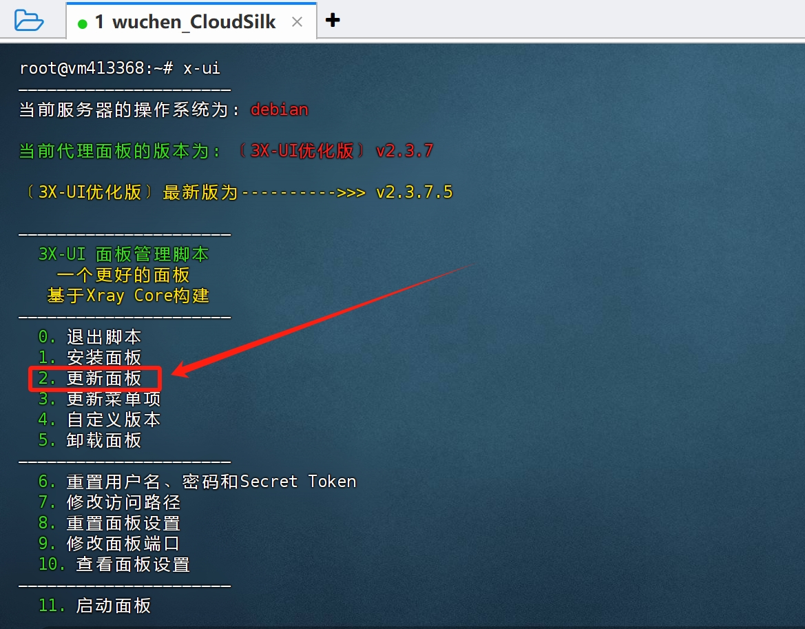
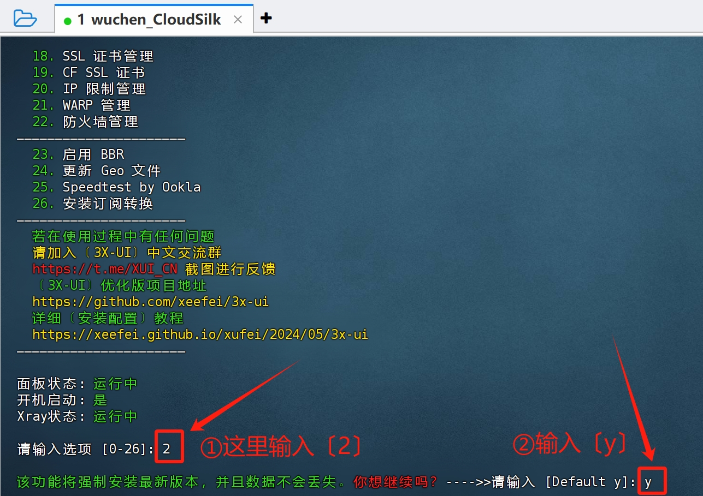
- 在到这一步必须要注意：要保留旧设置的话，需要输入【n】
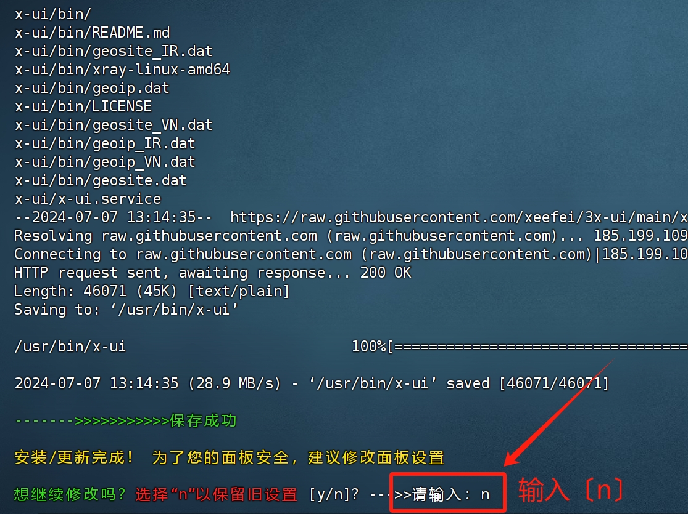


## 安装指定版本

若要安装指定的版本，请使用以下安装命令。 e.g., ver `v2.4.5`:

```
VERSION=v2.4.5 && bash <(curl -Ls "https://raw.githubusercontent.com/xeefei/3x-ui/$VERSION/install.sh") $VERSION
```
------------
## 若你的VPS默认有防火墙，请在安装完成之后放行指定端口
- 放行【面板登录端口】
- 放行出入站管理协议端口
- 如果要申请安装证书并每3个月【自动续签】证书，请确保80和443端口是放行打开的
- 可通过此脚本的第【22】选项去安装防火墙进行管理，如下图：

- 若要一次性放行多个端口或一整个段的端口，用英文逗号隔开。
#### PS：若你的VPS没有防火墙，则所有端口都是能够ping通的，可自行选择是否进入脚本安装防火墙保证安全，但安装了防火墙必须放行相应端口。

------------
## 安装证书开启https方式实现域名登录访问管理面板/偷自己
#### PS：如果不需要以上功能或无域名，可以跳过这步，
##### 1、把自己的域名托管到CF，并解析到自己VPS的IP，不要开启【小云朵】，
##### 2、如果要申请安装证书并每3个月【自动续签】证书，请确保80和443端口是放行打开的，
##### 3、输入x-ui命令进入面板管理脚本，通过选择第【18】选项去进行安装，
##### 4、记录好已经安装证书的【路径】，位置在：/root/.acme.sh/（域名）_ecc，后续需要用到，
##### 5、进入后台【面板设置】—–>【常规】中，去分别填入刚才已经记录的证书公钥、私钥路径，
##### 6、点击左上角的【保存】和【重启面板】，即可用自己域名进行登录管理；也可按照后续方法实现【自己偷自己】。

------------
## 登录面板进行【常规】设置
### 特别是如果在安装过程中，全部都是默认【回车键】安装的话，用户名/密码/访问路径是随机的，而面板监听端口默认是2053，最好进入面板更改，
##### 1、填写自己想要设置的【面板监听端口】，并去登录SSH放行，
##### 2、更改自己想要设置的【面板登录访问路径】，后续加上路径登录访问，
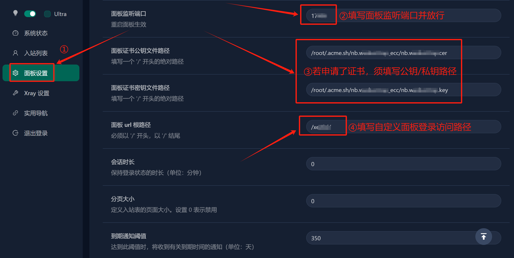
##### 3、其他：安全设定和电报机器人等配置，可自行根据需求去进行设置，
##### 4、若申请了证书须填写证书公钥/私钥路径，建议配置电报机器人方便管理，
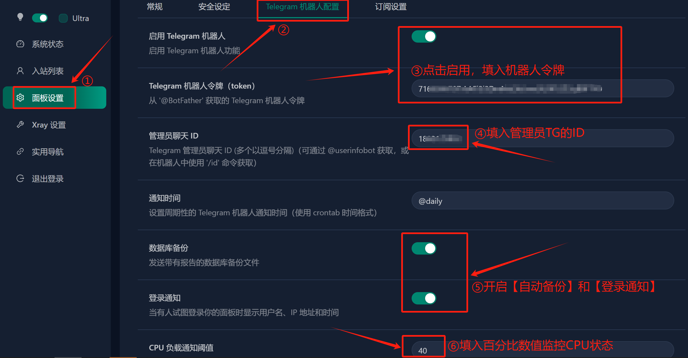
##### 5、面板设置【改动保存】之后，都需要点击左上角【重启面板】，才能生效。
#### PS：若你在正确完成了上述步骤之后，你没有安装证书的情况下，去用IP+端口号/路径的方式却不能访问面板，那请检查一下是不是你的浏览器自动默认开启了https模式，需要手动调整一下改成http方式，把“s”去掉，即可访问成功。

------------
## 创建【入站协议】和添加【客户端】，并测试上网
##### 1、点击左边【入站列表】，然后【添加入站】，传输方式保持【TCP】不变，尽量选择主流的vless+reality+vision协议组合，
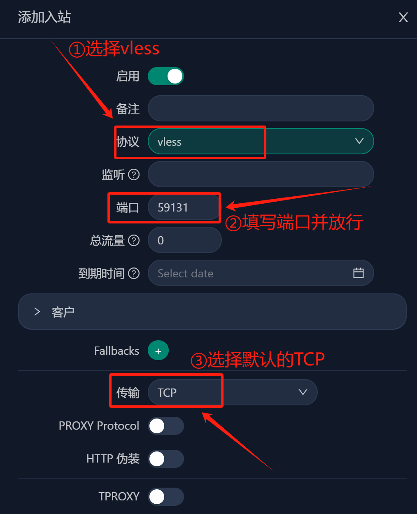
##### 2、在选择reality协议时，偷的域名可以使用默认的，要使用其他的，请替换尽量保持一致就行，比如Apple、Yahoo，VPS所在地区的旅游、学校网站等；如果要实现【偷自己】，请参看后续【如何偷自己】的说明部分；而私钥/公钥部分，可以直接点击下方的【Get New Cert】获取一个随机的，
##### 3、在创建reality协议过程中，至于其他诸如：PROXY Protocol，HTTP 伪装，TPROXY，External Proxy等等选项，若无特殊要求，保持默认设置即可，不用去动它们，
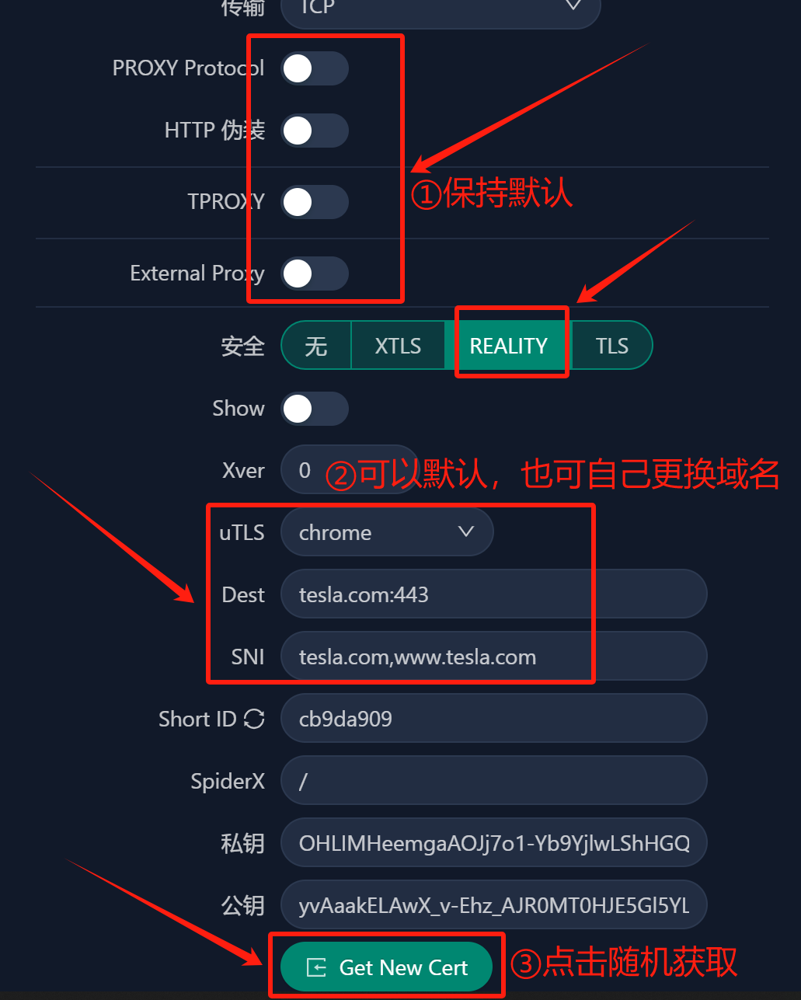
##### 4、创建好入站协议之后，默认只有一个客户端，可根据自己需求继续添加；重点：并编辑客户端，选择【Flow流控】为xtls-rprx-vision-udp443，
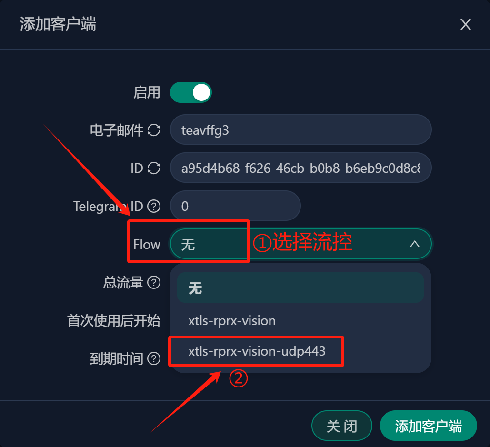
##### 5、其他：流量限制，到期时间，客户TG的ID等选项根据自己需求填写，
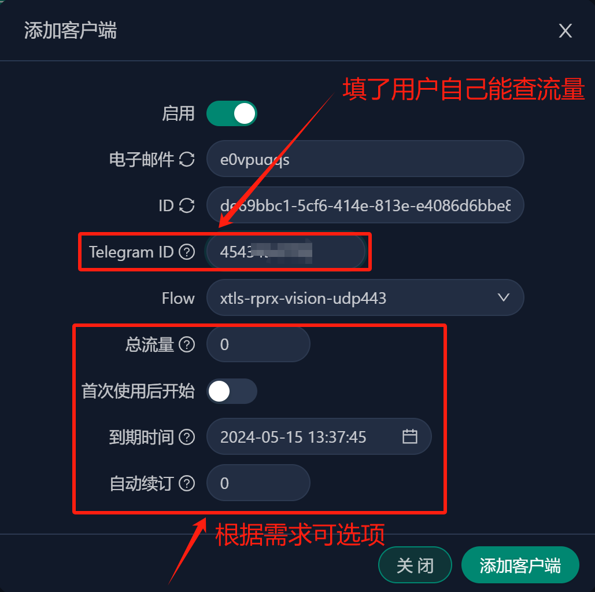
##### 6、一定要放行端口之后，确保端口能够ping通，再导入软件，
##### 7、点击二维码或者复制链接导入到v2rayN等软件中进行测试。

------------
## 备份与恢复/迁移数据库（以Debian系统为例）
#### 一、备份：通过配置好电报管理机器人，并去设置开启【自动备份】，每天凌晨12点会通过VPS管理机器人获取【备份配置】文件，有x-ui.db和config.json两个文件，可自行下载保存到自己电脑里面，

#### 二、搭建：在新的VPS中全新安装好3x-ui面板，通过脚本放行之前配置的所有端口，一次性放行多个端口请用【英文逗号】分隔，
#### 三、若需要安装证书，则提前把域名解析到新的VPS对应的IP，并且去输入x-ui选择第【18】选项去安装，并记录公钥/私钥的路径，无域名则跳过这一步，
#### 四、恢复：SSH登录服务器找到/etc/x-ui/x-ui.db和/usr/local/x-ui/bin/config.json文件位置，上传之前的两个备份文件，进行覆盖，

##### PS：把之前通过自动备份下载得到的两个文件上传覆盖掉旧文件，重启3x-ui面板即可【迁移成功】；即使迁移过程中出现问题，你是有备份文件的，不用担心，多试几次。

#### 五、若安装了证书，去核对/更改一下证书的路径，一般是同一个域名的话，位置在：/root/.acme.sh/（域名）_ecc，路径是相同的就不用更改，
#### 六、重启面板/重启服务器，让上述步骤生效即可，这时可以看到所有配置都是之前自己常用的，包括面板用户名、密码，入站、客户端，电报机器人配置等。

------------
## 安装完成后如何设置调整成【中文界面】？
- 方法一：通过管理后台【登录页面】调整，登录时可以选择，如下图：

- 方法二：通过在管理后台-->【面板设置】中去选择设置，如下图：

- 【TG机器人】设置中文：通过在管理后台-->【面板设置】-->【机器人配置】中去选择设置，并建议打开数据库备份和登录通知，如下图：
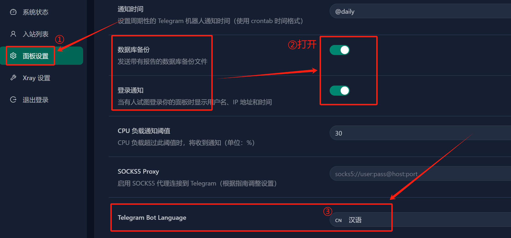

------------
## 用3x-ui如何实现【自己偷自己】？
- 其实很简单，只要你为面板设置了证书，
- 开启了HTTPS登录，就可以将3x-ui自身作为Web Server，
- 无需Nginx等，这里给一个示例：
- 其中目标网站（Dest）请填写面板监听端口，
- 可选域名（SNI）填写面板登录域名，
- 如果您使用其他web server（如nginx）等，
- 将目标网站改为对应监听端口也可。
- 需要说明的是，如果您处于白名单地区，自己“偷”自己并不适合你；
- 其次，可选域名一项实际上可以填写任意SNI，只要客户端保持一致即可，不过并不推荐这样做。
- 配置方法如下图所示：
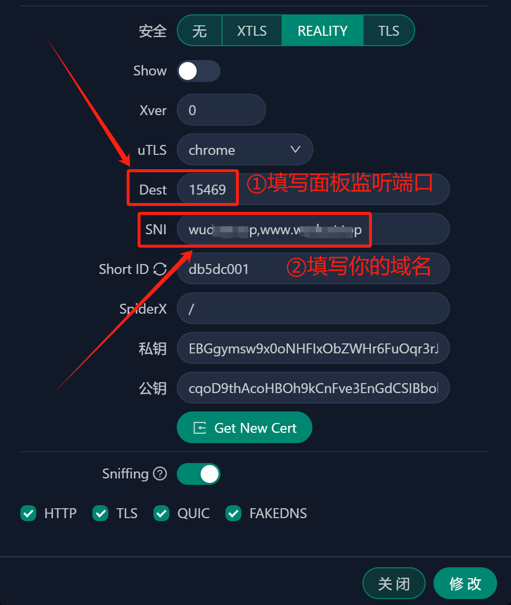

------------
## 〔子域名〕被墙针对特征
#### 网络表现：
##### 1、可以Ping通域名和IP地址，
##### 2、子域名无法打开3X-UI管理界面，
##### 3、什么都正常就是不能上网；

#### 问题：
##### 你的子域名被墙针对了：无法上网！

#### 解决方案：
##### 1、更换为新的子域名，
##### 2、解析新的子域名到VPS的IP，
##### 3、重新去安装新证书，
##### 4、重启3X-UI和服务器，
##### 5、重新去获取链接并测试上网。
#### PS：若通过以上步骤还是不能正常上网，则重装VPS服务器OS系统，以及3X-UI面板全部重新安装，之后就正常了！

------------
## 在自己的VPS服务器部署【订阅转换】功能
### 如何把vless/vmess等协议转换成Clash/Surge等软件支持的格式？
##### 1、进入脚本输入x-ui命令调取面板，选择第【24】选项安装订阅转换模块，如下图：

##### 2、等待安装【订阅转换】成功之后，访问地址：你的IP:18080（端口号）进行转换，
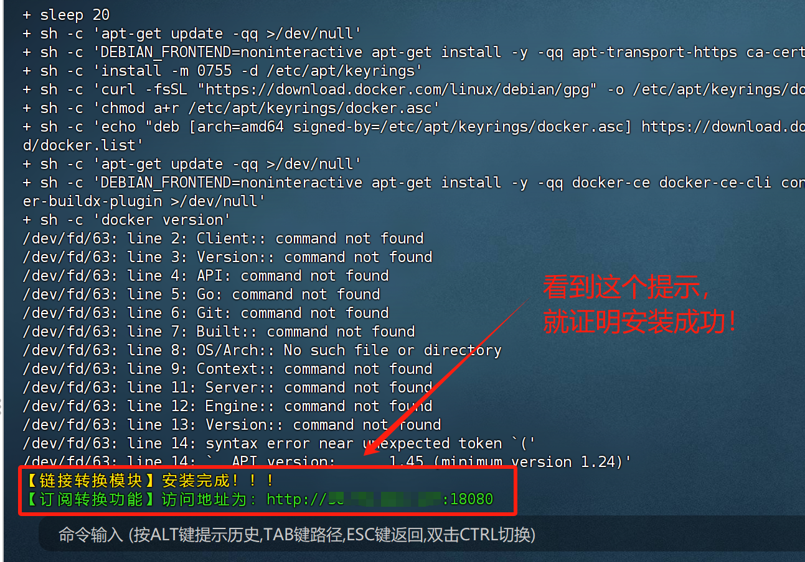
##### 3、因为在转换过程中需要调取后端API，所以请确保端口25500是打开放行的，
##### 4、在得到【转换链接】之后，只要你的VPS服务器25500端口是能ping通的，就能导入Clash/Surge等软件成功下载配置，
##### 5、此功能集成到3x-ui面板中，是为了保证安全，通过调取24选项把【订阅转换】功能部署在自己的VPS中，不会造成链接泄露。
### 【订阅转换】功能在自己的VPS中安装部署成功之后的界面如下图所示：
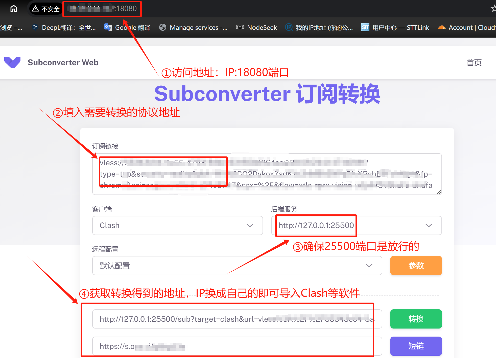

------------
## 如何保护自己的IP不被墙被封？
##### 1、使用的代理协议要安全，加密是必备，推荐使用vless+reality+vision协议组合，
##### 2、因为有时节点会共享，在不同的地区，多个省份之间不要共同连接同一个IP，
##### 3、连接同一个IP就算了，不要同一个端口，不要同IP+同端口到处漫游，要分开，
##### 4、同一台VPS，不要在一天内一直大流量去下载东西使用，不要流量过高要切换，
##### 5、创建【入站协议】的时候，尽量用【高位端口】，比如40000--65000之间的端口号。
#### 提醒：为什么在特殊时期，比如：两会，春节等被封得最严重最惨？
##### 尼玛同一个IP+同一个端口号，多个省份去漫游，跟开飞机场一样！不封你，封谁的IP和端口？
#### 总结：不要多终端/多省份/多个朋友/共同使用同一个IP和端口号！使用3x-ui多创建几个【入站】，
####      多做几条备用，各用各的！各行其道才比较安全！GFW的思维模式是干掉机场，机场的特征个人用户不要去沾染，自然IP就保护好了。

------------
## SSL 认证

<details>
  <summary>点击查看 SSL 认证</summary>

### ACME

要使用 ACME 管理 SSL 证书：

1. 确保您的域名已正确解析到服务器，
2. 输入“x-ui”命令并选择“SSL 证书管理”，
3. 您将看到以下选项：

   - **获取证书** ----获取SSL证书
   - **吊销证书** ----吊销现有的SSL证书
   - **续签证书** ----强制续签SSL证书
   - **显示所有证书** ----显示服务器中所有能用的证书
   - **设置面板证书路径** ----指定面板要使用的证书


### Certbot

安装和使用 Certbot：

```sh
apt-get install certbot -y
certbot certonly --standalone --agree-tos --register-unsafely-without-email -d yourdomain.com
certbot renew --dry-run
```

### Cloudflare

管理脚本具有用于 Cloudflare 的内置 SSL 证书应用程序。若要使用此脚本申请证书，需要满足以下条件：

- Cloudflare 邮箱地址
- Cloudflare Global API Key
- 域名已通过 cloudflare 解析到当前服务器

**如何获取 Cloudflare全局API密钥:**

1. 在终端中输入“x-ui”命令，然后选择“CF SSL 证书”。
2. 访问链接: [Cloudflare API Tokens](https://dash.cloudflare.com/profile/api-tokens).
3. 点击“查看全局 API 密钥”（如下图所示）：
   
4. 您可能需要重新验证您的帐户。之后，将显示 API 密钥（请参见下面的屏幕截图）：
   

使用时，只需输入您的“域名”、“电子邮件”和“API KEY”即可。示意图如下：
   


</details>

------------
## 手动安装 & 升级

<details>
  <summary>点击查看 手动安装 & 升级</summary>

#### 使用

1. 若要将最新版本的压缩包直接下载到服务器，请运行以下命令：

```sh
ARCH=$(uname -m)
case "${ARCH}" in
  x86_64 | x64 | amd64) XUI_ARCH="amd64" ;;
  i*86 | x86) XUI_ARCH="386" ;;
  armv8* | armv8 | arm64 | aarch64) XUI_ARCH="arm64" ;;
  armv7* | armv7) XUI_ARCH="armv7" ;;
  armv6* | armv6) XUI_ARCH="armv6" ;;
  armv5* | armv5) XUI_ARCH="armv5" ;;
  s390x) echo 's390x' ;;
  *) XUI_ARCH="amd64" ;;
esac


wget https://github.com/xeefei/3x-ui/releases/latest/download/x-ui-linux-${XUI_ARCH}.tar.gz
```

2. 下载压缩包后，执行以下命令安装或升级 x-ui：

```sh
ARCH=$(uname -m)
case "${ARCH}" in
  x86_64 | x64 | amd64) XUI_ARCH="amd64" ;;
  i*86 | x86) XUI_ARCH="386" ;;
  armv8* | armv8 | arm64 | aarch64) XUI_ARCH="arm64" ;;
  armv7* | armv7) XUI_ARCH="armv7" ;;
  armv6* | armv6) XUI_ARCH="armv6" ;;
  armv5* | armv5) XUI_ARCH="armv5" ;;
  s390x) echo 's390x' ;;
  *) XUI_ARCH="amd64" ;;
esac

cd /root/
rm -rf x-ui/ /usr/local/x-ui/ /usr/bin/x-ui
tar zxvf x-ui-linux-${XUI_ARCH}.tar.gz
chmod +x x-ui/x-ui x-ui/bin/xray-linux-* x-ui/x-ui.sh
cp x-ui/x-ui.sh /usr/bin/x-ui
cp -f x-ui/x-ui.service /etc/systemd/system/
mv x-ui/ /usr/local/
systemctl daemon-reload
systemctl enable x-ui
systemctl restart x-ui
```

</details>

------------
## 通过Docker安装

<details>
  <summary>点击查看 通过Docker安装</summary>

#### 使用


1. **安装Docker**

   ```sh
   bash <(curl -sSL https://get.docker.com)
   ```


2. **克隆项目仓库**

   ```sh
   git clone https://github.com/xeefei/3x-ui.git
   cd 3x-ui
   ```

3. **启动服务**：

   ```sh
   docker compose up -d
   ```

   添加 ```--pull always``` 标志使 docker 在拉取更新的镜像时自动重新创建容器。有关更多信息，请参阅：https://docs.docker.com/reference/cli/docker/container/run/#pull

   **或**

   ```sh
   docker run -itd \
      -e XRAY_VMESS_AEAD_FORCED=false \
      -v $PWD/db/:/etc/x-ui/ \
      -v $PWD/cert/:/root/cert/ \
      --network=host \
      --restart=unless-stopped \
      --name 3x-ui \
      ghcr.io/xeefei/3x-ui:latest
   ```

4. **更新至最新版本**

   ```sh
   cd 3x-ui
   docker compose down
   docker compose pull 3x-ui
   docker compose up -d
   ```

5. **从Docker中删除3x-ui **

   ```sh
   docker stop 3x-ui
   docker rm 3x-ui
   cd --
   rm -r 3x-ui
   ```

</details>

------------
## 建议使用的操作系统

- Ubuntu 20.04+
- Debian 11+
- CentOS 8+
- OpenEuler 22.03+
- Fedora 36+
- Arch Linux
- Manjaro
- Armbian
- AlmaLinux 8.0+
- Rocky Linux 8+
- Oracle Linux 8+
- OpenSUSE Tubleweed
- Amazon Linux 2023

------------
## 支持的架构和设备
<details>
  <summary>点击查看 支持的架构和设备</summary>

我们的平台提供与各种架构和设备的兼容性，确保在各种计算环境中的灵活性。以下是我们支持的关键架构：

- **amd64**: 这种流行的架构是个人计算机和服务器的标准，可以无缝地适应大多数现代操作系统。

- **x86 / i386**: 这种架构在台式机和笔记本电脑中被广泛采用，得到了众多操作系统和应用程序的广泛支持，包括但不限于 Windows、macOS 和 Linux 系统。

- **armv8 / arm64 / aarch64**: 这种架构专为智能手机和平板电脑等当代移动和嵌入式设备量身定制，以 Raspberry Pi 4、Raspberry Pi 3、Raspberry Pi Zero 2/Zero 2 W、Orange Pi 3 LTS 等设备为例。

- **armv7 / arm / arm32**: 作为较旧的移动和嵌入式设备的架构，它仍然广泛用于Orange Pi Zero LTS、Orange Pi PC Plus、Raspberry Pi 2等设备。

- **armv6 / arm / arm32**: 这种架构面向非常老旧的嵌入式设备，虽然不太普遍，但仍在使用中。Raspberry Pi 1、Raspberry Pi Zero/Zero W 等设备都依赖于这种架构。

- **armv5 / arm / arm32**: 它是一种主要与早期嵌入式系统相关的旧架构，目前不太常见，但仍可能出现在早期 Raspberry Pi 版本和一些旧智能手机等传统设备中。
</details>

------------
## Languages

- English（英语）
- Farsi（伊朗语）
- Simplified Chinese（简体中文）
- Traditional Chinese（繁体中文）            
- Russian（俄语）
- Vietnamese（越南语）
- Spanish（西班牙语）
- Indonesian （印度尼西亚语）
- Ukrainian（乌克兰语）
- Turkish（土耳其语）
- Português (葡萄牙语)

------------
## 项目特点

- 系统状态查看与监控
- 可搜索所有入站和客户端信息
- 深色/浅色主题随意切换
- 支持多用户和多协议
- 支持多种协议，包括 VMess、VLESS、Trojan、Shadowsocks、Dokodemo-door、Socks、HTTP、wireguard
- 支持 XTLS 原生协议，包括 RPRX-Direct、Vision、REALITY
- 流量统计、流量限制、过期时间限制
- 可自定义的 Xray配置模板
- 支持HTTPS访问面板（自备域名+SSL证书）
- 支持一键式SSL证书申请和自动续签证书
- 更多高级配置项目请参考面板去进行设定
- 修复了 API 路由（用户设置将使用 API 创建）
- 支持通过面板中提供的不同项目更改配置。
- 支持从面板导出/导入数据库

## 默认面板设置

<details>

  <summary>点击查看 默认设置</summary>

  ### 默认信息

- **端口** 
    - 2053
- **用户名 & 密码 & 访问路径** 
    - 当您跳过设置时，这些信息会随机生成，
    - 您也可以在安装的时候自定义访问路径。
- **数据库路径：**
  - /etc/x-ui/x-ui.db
- **Xray 配置路径：**
  - /usr/local/x-ui/bin/config.json
- **面板链接（无SSL）：**
  - http://ip:2053/访问路径/panel
- **面板链接（有SSL）：**
  - https://你的域名:2053/访问路径/panel

</details>

------------
## [WARP 配置](https://gitlab.com/fscarmen/warp)

<details>
  <summary>点击查看 WARP 配置</summary>

#### 使用

**对于版本 `v2.1.0` 及更高版本：**

WARP 是内置的，无需额外安装；只需在面板中打开必要的配置即可。

**如果要在 v2.1.0 之前使用 WARP 路由**，请按照以下步骤操作：

**1.** 在 **SOCKS Proxy Mode** 模式中安装Wrap

   - **Account Type (free, plus, team):** Choose the appropriate account type.
   - **Enable/Disable WireProxy:** Toggle WireProxy on or off.
   - **Uninstall WARP:** Remove the WARP application.

**2.** 如果您已经安装了 warp，您可以使用以下命令卸载：

   ```sh
   warp u
   ```

**3.** 在面板中打开您需要的配置

   配置:

   - Block Ads
   - Route Google, Netflix, Spotify, and OpenAI (ChatGPT) traffic to WARP
   - Fix Google 403 error


</details>

------------
## IP 限制

<details>
  <summary>点击查看 IP 限制</summary>

#### 使用

**注意：** 使用 IP 隧道时，IP 限制无法正常工作。

- 对于 `v1.6.1`之前的版本 ：

  - IP 限制 已被集成在面板中。

- 对于 `v1.7.0` 以及更新的版本：

  - 要使 IP 限制正常工作，您需要按照以下步骤安装 fail2ban 及其所需的文件：

    1. 使用面板内置的 `x-ui` 指令
    2. 选择 `IP Limit Management`.
    3. 根据您的需要选择合适的选项。
   
  - 确保您的 Xray 配置上有 ./access.log 。在 v2.1.3 之后，我们有一个选项。
  
  ```sh
    "log": {
      "access": "./access.log",
      "dnsLog": false,
      "loglevel": "warning"
    },
    ```
  - 您需要在Xray配置中手动设置〔访问日志〕的路径。

</details>

------------
## Telegram 机器人

<details>
  <summary>点击查看 Telegram 机器人</summary>

#### 使用

Web 面板通过 Telegram Bot 支持每日流量、面板登录、数据库备份、系统状态、客户端信息等通知和功能。要使用机器人，您需要在面板中设置机器人相关参数，包括：

- 电报令牌
- 管理员聊天 ID
- 通知时间（cron 语法）
- 到期日期通知
- 流量上限通知
- 数据库备份
- CPU 负载通知


**参考：**

- `30 \* \* \* \* \*` - 在每个点的 30 秒处通知
- `0 \*/10 \* \* \* \*` - 每 10 分钟的第一秒通知
- `@hourly` - 每小时通知
- `@daily` - 每天通知 (00:00)
- `@weekly` - 每周通知
- `@every 8h` - 每8小时通知

### Telegram Bot 功能

- 定期报告
- 登录通知
- CPU 阈值通知
- 提前报告的过期时间和流量阈值
- 如果将客户的电报用户名添加到用户的配置中，则支持客户端报告菜单
- 支持使用UUID（VMESS/VLESS）或密码（TROJAN）搜索报文流量报告 - 匿名
- 基于菜单的机器人
- 通过电子邮件搜索客户端（仅限管理员）
- 检查所有入库
- 检查服务器状态
- 检查耗尽的用户
- 根据请求和定期报告接收备份
- 多语言机器人

### 注册 Telegram bot

- 与 [Botfather](https://t.me/BotFather) 对话：
    
  
- 使用 /newbot 创建新机器人：你需要提供机器人名称以及用户名，注意名称中末尾要包含“bot”
    

- 启动您刚刚创建的机器人。可以在此处找到机器人的链接。
    

- 输入您的面板并配置 Telegram 机器人设置，如下所示：
    

在输入字段编号 3 中输入机器人令牌。
在输入字段编号 4 中输入用户 ID。具有此 id 的 Telegram 帐户将是机器人管理员。 （您可以输入多个，只需将它们用“ ，”分开即可）

- 如何获取TG ID? 使用 [bot](https://t.me/useridinfobot)， 启动机器人，它会给你 Telegram 用户 ID。


</details>

------------
## API 路由

<details>
  <summary>点击查看 API 路由</summary>

#### 使用

- `/login` 使用 `POST` 用户名称 & 密码： `{username: '', password: ''}` 登录
- `/panel/api/inbounds` 以下操作的基础：

| 方法   |  路径                               | 操作                                        |
| :----: | ---------------------------------- | ------------------------------------------- |
| `GET`  | `"/list"`                          | 获取所有入站                                 |
| `GET`  | `"/get/:id"`                       | 获取所有入站以及inbound.id                   |
| `GET`  | `"/getClientTraffics/:email"`      | 通过电子邮件获取客户端流量                    |
| `GET`  | `"/getClientTrafficsById/:id"`     | 通过用户ID获取客户端流量                      |
| `GET`  | `"/createbackup"`                  | Telegram 机器人向管理员发送备份               |
| `POST` | `"/add"`                           | 添加入站                                    |
| `POST` | `"/del/:id"`                       | 删除入站                                    |
| `POST` | `"/update/:id"`                    | 更新入站                                    |
| `POST` | `"/clientIps/:email"`              | 客户端 IP 地址                              | 
| `POST` | `"/clearClientIps/:email"`         | 清除客户端 IP 地址                           |
| `POST` | `"/addClient"`                     | 将客户端添加到入站                           |
| `POST` | `"/:id/delClient/:clientId"`       | 通过 clientId\* 删除客户端                   |
| `POST` | `"/updateClient/:clientId"`        | 通过 clientId\* 更新客户端                   |
| `POST` | `"/:id/resetClientTraffic/:email"` | 重置客户端的流量                             |
| `POST` | `"/resetAllTraffics"`              | 重置所有入站的流量                           |
| `POST` | `"/resetAllClientTraffics/:id"`    | 重置入站中所有客户端的流量                    |
| `POST` | `"/delDepletedClients/:id"`        | 删除入站耗尽的客户端 （-1： all）             |
| `POST` | `"/onlines"`                       | 获取在线用户 （ 电子邮件列表 ）               |

- 使用`clientId` 项应该填写下列数据：

- `client.id` for VMESS and VLESS
- `client.password` for TROJAN
- `client.email` for Shadowsocks


- [API 文档](https://documenter.getpostman.com/view/16802678/2s9YkgD5jm)

- [](https://app.getpostman.com/run-collection/16802678-1a4c9270-ac77-40ed-959a-7aa56dc4a415?action=collection%2Ffork&source=rip_markdown&collection-url=entityId%3D16802678-1a4c9270-ac77-40ed-959a-7aa56dc4a415%26entityType%3Dcollection%26workspaceId%3D2cd38c01-c851-4a15-a972-f181c23359d9)
</details>

------------
## 环境变量

<details>
  <summary>点击查看 环境变量</summary>

#### Usage

| 变量            |                      Type                      | 默认          |
| -------------- | :--------------------------------------------: | :------------ |
| XUI_LOG_LEVEL  | `"debug"` \| `"info"` \| `"warn"` \| `"error"` | `"info"`      |
| XUI_DEBUG      |                   `boolean`                    | `false`       |
| XUI_BIN_FOLDER |                    `string`                    | `"bin"`       |
| XUI_DB_FOLDER  |                    `string`                    | `"/etc/x-ui"` |
| XUI_LOG_FOLDER |                    `string`                    | `"/var/log"`  |

例子：

```sh
XUI_BIN_FOLDER="bin" XUI_DB_FOLDER="/etc/x-ui" go build main.go
```

</details>

------------
## 预览

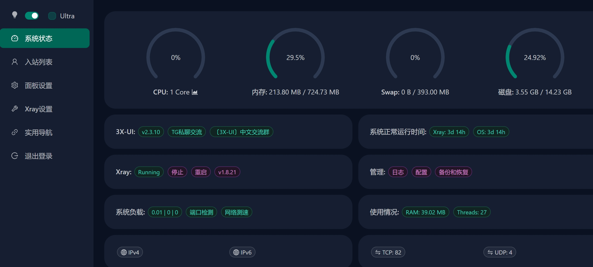
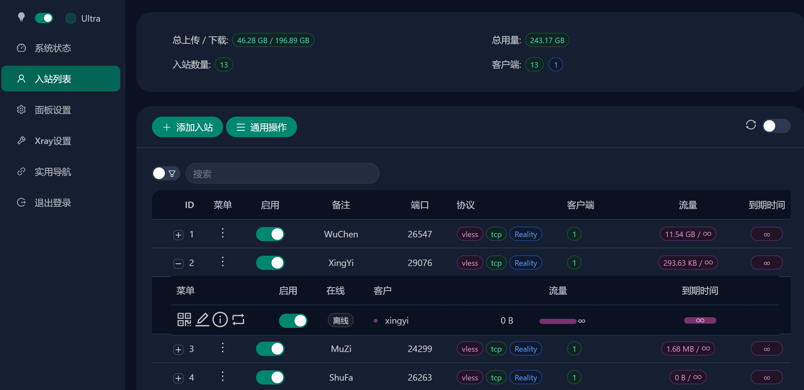

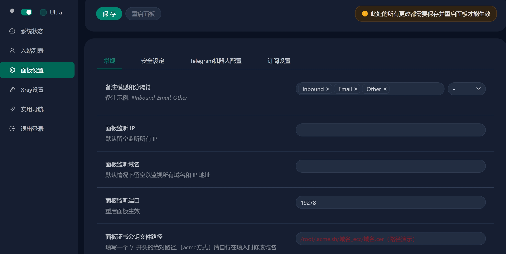
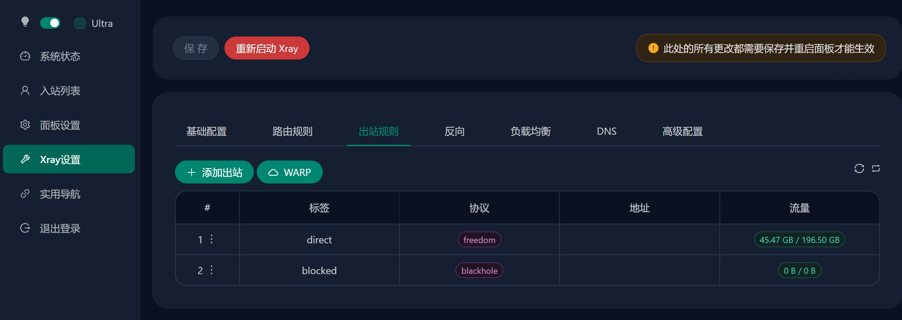
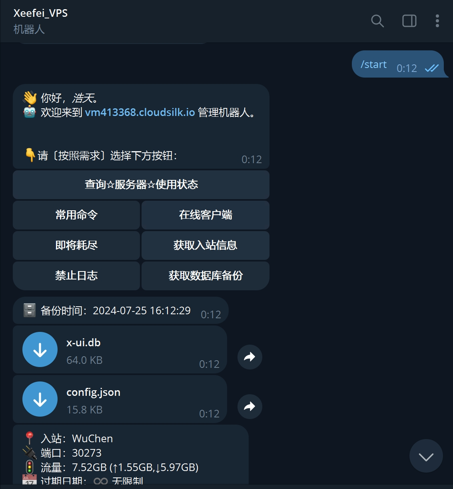

------------
## 广告赞助
- 如果你觉得本项目对你有用，而且你也恰巧有这方面的需求，你也可以选择通过我的购买链接赞助我。
- [搬瓦工GIA高端线路，仅推荐购买GIA套餐](https://bandwagonhost.com/aff.php?aff=75015)
- [Dmit高端GIA线路](https://www.dmit.io/aff.php?aff=9326)
- [白丝云【4837线路】实惠量大管饱](https://cloudsilk.io/aff.php?aff=706)

------------
## 特别感谢

- [alireza0](https://github.com/alireza0/)

------------
## 致谢

- [Iran v2ray rules](https://github.com/chocolate4u/Iran-v2ray-rules) (License: **GPL-3.0**): _Enhanced v2ray/xray and v2ray/xray-clients routing rules with built-in Iranian domains and a focus on security and adblocking._
- [Vietnam Adblock rules](https://github.com/vuong2023/vn-v2ray-rules) (License: **GPL-3.0**): _A hosted domain hosted in Vietnam and blocklist with the most efficiency for Vietnamese._

------------
## Star 趋势

[](https://starchart.cc/xeefei/3x-ui)
